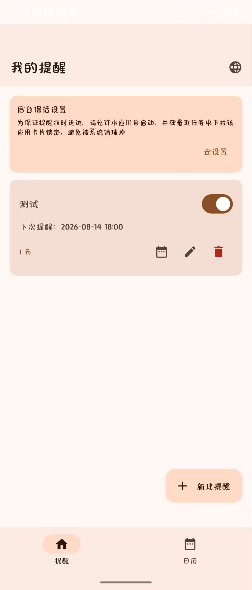
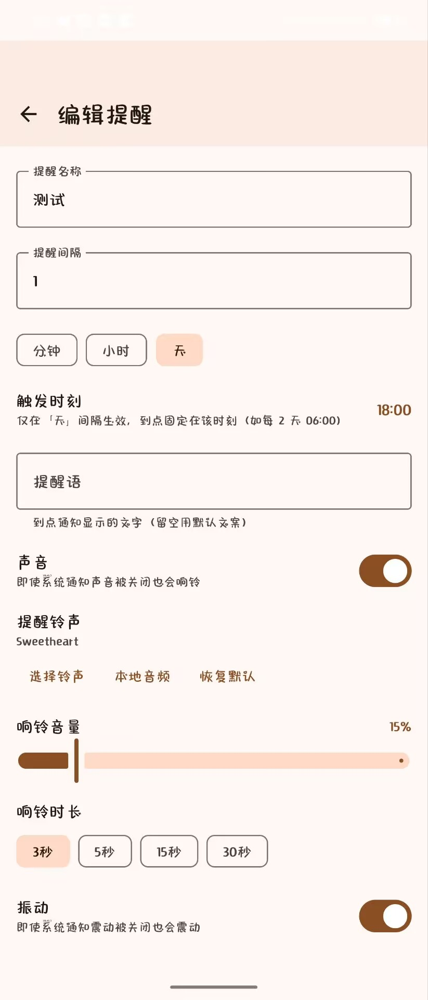
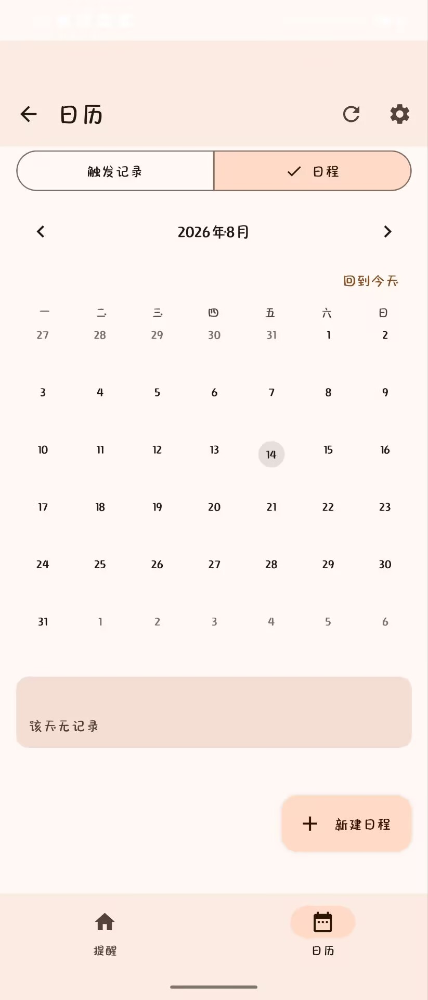
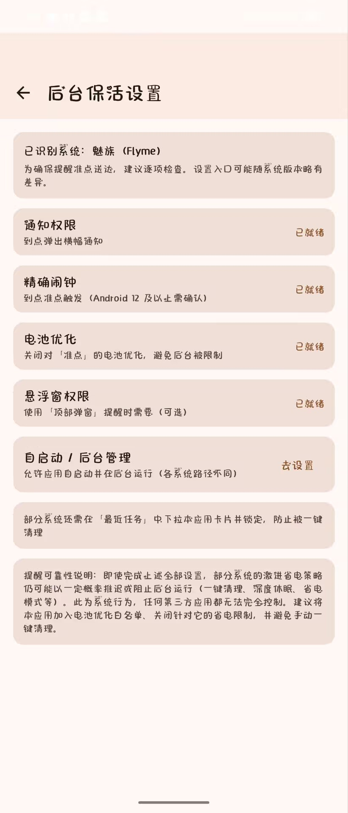

# 准点 (Zhundian) — 间隔提醒

A simple, reliable, privacy-first **fixed-interval reminder** app for Android：定时吃药、定时喝水、周期性检查、习惯养成。

无需联网，数据全部保存在本地。

> **🤖 Vibecoding 产物**：本项目由 Claude Code 调用 DeepSeek-V4-Flash API 驱动开发完成。

## 功能

- **固定间隔循环提醒**：为每条提醒设置名称与间隔（分钟 / 小时 / 天），到点通知栏横幅提醒，并自动按同一间隔永久循环，直到停用或删除
- **「天」间隔固定时刻**：每天 / 每 N 天可固定在指定时刻触发（如「每 2 天 @ 06:00」），改期 / 顺延不移动节奏
- **系统日历同步**：把系统日历日程导入为提醒（按来源选择性同步、只读日历自动排除），到点同样提醒
- **内置日历**：自绘月历查看触发记录（已完成 / 已触发 / 已改期着色），支持单条与批量删除
- **铃声与震动**：系统铃声 / 本地音频、音量、响铃时长档位；勿扰模式仍走闹钟流强制响铃；通知栏「完成 / 再隔 1 小时」快捷操作
- **顶部悬浮窗**：到点在屏幕上方弹出醒目横幅，不打断当前操作
- **多 ROM 保活**：适配国产主流系统（小米 / OPPO / vivo / 华为 / 荣耀 / 魅族）与三星的自启动 / 后台管理入口引导
- **多语言**：简体中文 / 繁體中文 / English / 日本語 / Русский / Français / Español / Deutsch，支持应用内切换

## 后台运行与提醒可靠性

> 准点使用前台服务 + 精确闹钟 + 自启动 / 电池优化白名单引导，已尽力最大化提醒的准时性。但**即使在完成上述全部设置后，部分系统的激进省电策略仍可能以一定概率推迟或阻止后台运行**——一键清理、深度休眠、省电模式等系统行为，无法被任何第三方应用完全控制。
>
> **建议**：在 App 内「后台保活设置」页完成全部设置，将本应用加入电池优化白名单、关闭针对它的省电限制，并避免手动一键清理。若发现提醒偶有延迟，请优先检查这些设置是否生效。

## 隐私

- **无网络权限**：Manifest 未声明 `INTERNET`，App 不联网、无账号、无统计
- **数据全本地**：提醒、触发记录、设置全部存储在设备本地（Room / SharedPreferences）
- 权限仅在功能需要时按需申请

### 权限说明

| 权限 | 用途 |
| --- | --- |
| `POST_NOTIFICATIONS` | 到点通知横幅（Android 13+ 运行时授权） |
| `USE_EXACT_ALARM` / `SCHEDULE_EXACT_ALARM` | 精确闹钟，保证准点触发 |
| `VIBRATE` / `WAKE_LOCK` | 强制震动 / 播放铃声时持唤醒锁 |
| `SYSTEM_ALERT_WINDOW` | 顶部悬浮窗（需手动授予「显示在其他应用上层」） |
| `RECEIVE_BOOT_COMPLETED` | 开机后恢复闹钟 |
| `FOREGROUND_SERVICE` / `FOREGROUND_SERVICE_SPECIAL_USE` | 前台服务保活与进程内调度 |
| `REQUEST_IGNORE_BATTERY_OPTIMIZATIONS` | 电池优化白名单（引导式授权） |
| `READ_CALENDAR` | 同步系统日历日程（需手动授予） |

## 构建

环境要求：JDK 17、Android SDK（compileSdk 35 / targetSdk 35 / minSdk 26）。

```bash
# Git Bash（Windows）下需显式指定 JDK 17 的 JAVA_HOME（正斜杠）
cd IntervalReminder
JAVA_HOME="D:/Android/jdk-17.0.2" ./gradlew :app:testDebugUnitTest :app:assembleDebug
```

- **签名**：正式包使用 `zhundian-release.keystore`，签名参数从 gitignored 的 `keystore.properties` 读取；CI / 无密码文件的环境可改用 `KEYSTORE_*` 环境变量注入（如 `KEYSTORE_STORE_PASSWORD`）。缺省时不影响 debug 构建。
- **测试**：Robolectric 单元测试随 `testDebugUnitTest` 运行。
- 国内网络环境：依赖解析已配置阿里云镜像，Gradle wrapper 使用腾讯云分发镜像。

## 截图

| 提醒列表 | 编辑提醒 |
| :---: | :---: |
|  |  |
| 日历 | 后台保活设置 |
|  |  |

## License

[MIT](./LICENSE)
